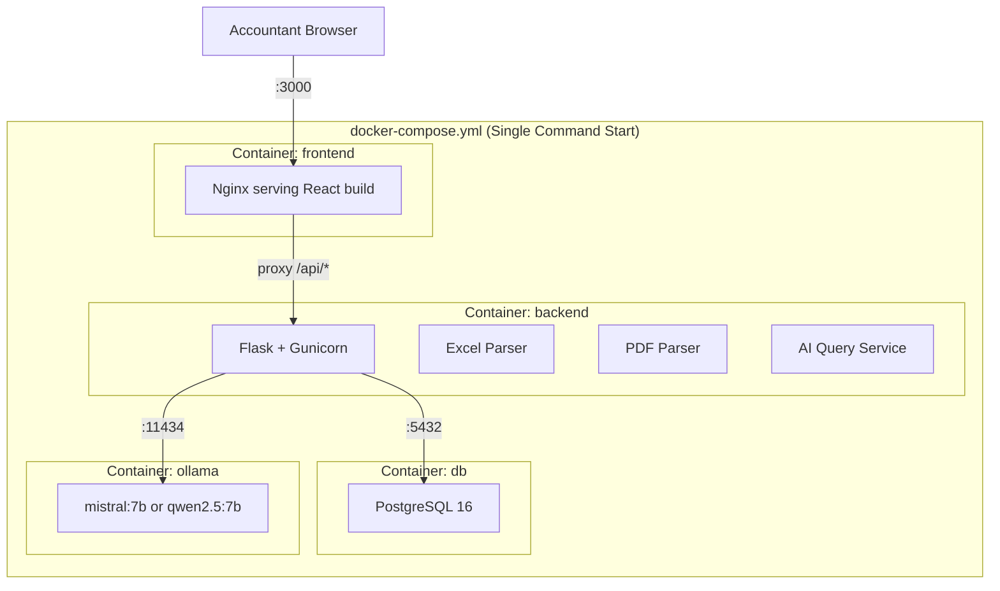
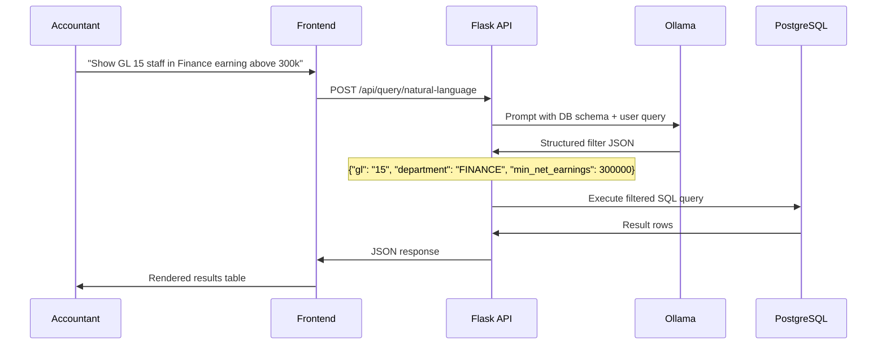
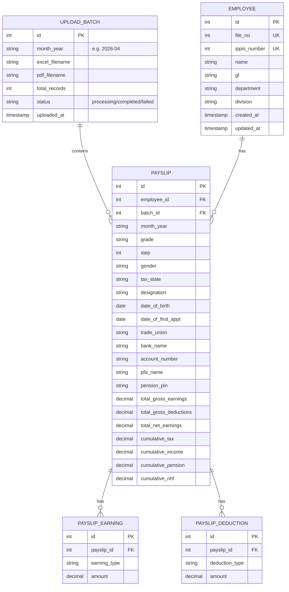

# PayRoll Query System — Implementation Plan v3

## Decisions Locked In

| Decision | Choice |
|----------|--------|
| Architecture | Full-Stack Web App, Dockerized |
| Containerization | Docker Compose — separate images per service |
| Users | Multi-user (multiple accountants) |
| PDF Parsing | Full financial detail extraction |
| Backend | Flask (Python) |
| Frontend | React (Vite) |
| Database | PostgreSQL (official Docker image) |
| AI Model | **Ollama (local)** — no API costs, data stays private |
| Deployment | Docker Compose (local/VPS) or Railway |

---

## Docker Architecture



### How It Works

| Question | Answer |
|----------|--------|
| Can frontend and backend be separate images? | **Yes** — that's the standard. Each has its own `Dockerfile` |
| Can the database be a pulled image? | **Yes** — we use the official `postgres:16-alpine` image, no custom build needed |
| How do they become one app? | **Docker Compose** — one `docker-compose up` command starts all 4 containers on an internal network |
| Can I deploy this anywhere? | **Yes** — any machine with Docker installed (local PC, VPS, Railway, AWS, etc.) |

### docker-compose.yml (Preview)

```yaml
services:
  # ── Frontend (React build served by Nginx) ──
  frontend:
    build: ./frontend
    ports:
      - "3000:80"
    depends_on:
      - backend

  # ── Backend (Flask API) ──
  backend:
    build: ./backend
    ports:
      - "5000:5000"
    depends_on:
      db:
        condition: service_healthy
      ollama:
        condition: service_started
    environment:
      - DATABASE_URL=postgresql://payroll:payroll_secret@db:5432/payroll_db
      - OLLAMA_URL=http://ollama:11434
      - UPLOAD_FOLDER=/app/uploads
    volumes:
      - uploads:/app/uploads

  # ── Database (Official PostgreSQL image — no build needed) ──
  db:
    image: postgres:16-alpine
    environment:
      - POSTGRES_DB=payroll_db
      - POSTGRES_USER=payroll
      - POSTGRES_PASSWORD=payroll_secret
    volumes:
      - pgdata:/var/lib/postgresql/data
    healthcheck:
      test: ["CMD-SHELL", "pg_isready -U payroll"]
      interval: 5s
      timeout: 5s
      retries: 5

  # ── AI Model (Ollama — no API key, no cost, data stays local) ──
  ollama:
    image: ollama/ollama
    ports:
      - "11434:11434"
    volumes:
      - ollama_data:/root/.ollama

volumes:
  pgdata:
  uploads:
  ollama_data:
```

> [!TIP]
> **One command to run everything**: `docker-compose up --build`
> This pulls PostgreSQL + Ollama images, builds frontend + backend images, and starts the entire app.

---

## Ollama vs Gemini API — Cost Comparison

| Factor | Gemini API | Ollama (Local) |
|--------|-----------|----------------|
| **Cost** | ~$0.15–$1.25 per 1M tokens | **Free forever** |
| **Data Privacy** | Salary data sent to Google servers | **Data never leaves your machine** |
| **Internet Required** | Yes | **No** (after initial model download) |
| **Speed** | ~1–3s (network latency) | ~1–5s (depends on hardware) |
| **Reliability** | Depends on Google's uptime | **Always available locally** |
| **Setup** | API key management | One-time model pull (~4GB) |

> [!IMPORTANT]
> **For payroll data (salaries, bank details, deductions), Ollama is the right choice.** Sending sensitive financial data to external APIs is a security risk. With Ollama, everything stays on your infrastructure.

### Recommended Ollama Models

| Model | Size | RAM Needed | Best For |
|-------|------|-----------|----------|
| **`mistral:7b`** | 4.1 GB | 8 GB | Best balance of quality + speed. Recommended. |
| **`qwen2.5:7b`** | 4.4 GB | 8 GB | Strong at structured output and SQL-like tasks |
| **`llama3.1:8b`** | 4.7 GB | 8 GB | General purpose, good instruction following |
| **`phi3:mini`** | 2.3 GB | 4 GB | If RAM is very limited |

> [!NOTE]
> The model is pulled once (`ollama pull mistral:7b`) and cached. It runs inside the Docker container.

### How NL Query Works with Ollama



---

## Database Schema



---

## API Endpoints

### Upload & Parsing
| Method | Endpoint | Description |
|--------|----------|-------------|
| `POST` | `/api/upload` | Upload Excel + PDF for a given month |
| `GET` | `/api/uploads` | List all uploaded batches |
| `GET` | `/api/uploads/:id/status` | Check processing status |

### Employees
| Method | Endpoint | Description |
|--------|----------|-------------|
| `GET` | `/api/employees` | Search/filter: `name`, `department`, `division`, `file_no`, `ippis_number`, `gl`, `page`, `per_page` |
| `GET` | `/api/employees/:id` | Employee detail + payslip history |

### Payslips
| Method | Endpoint | Description |
|--------|----------|-------------|
| `GET` | `/api/payslips` | List payslips with filters |
| `GET` | `/api/payslips/:id` | Full payslip detail (earnings + deductions) |

### Analytics
| Method | Endpoint | Description |
|--------|----------|-------------|
| `GET` | `/api/analytics/department-summary` | Salary totals, averages, headcount per dept |
| `GET` | `/api/analytics/gl-distribution` | Employee count + salary per GL level |
| `GET` | `/api/analytics/deduction-breakdown` | Deduction categories and totals |
| `GET` | `/api/analytics/salary-trends/:employee_id` | Month-over-month trends |
| `GET` | `/api/analytics/monthly-overview` | Total payroll per month |

### AI Query
| Method | Endpoint | Description |
|--------|----------|-------------|
| `POST` | `/api/query/natural-language` | Plain English → structured query via Ollama |

### Export
| Method | Endpoint | Description |
|--------|----------|-------------|
| `GET` | `/api/export` | Export filtered results as CSV |

---

## Project File Structure

```
PayRollQuery/
├── docker-compose.yml                # Orchestrates all 4 containers
│
├── backend/
│   ├── Dockerfile                    # Python 3.12 + Gunicorn
│   ├── requirements.txt
│   ├── run.py                        # Entry point
│   ├── app/
│   │   ├── __init__.py               # Flask app factory
│   │   ├── config.py                 # Env-based config
│   │   ├── extensions.py             # SQLAlchemy, Migrate, CORS
│   │   ├── models/
│   │   │   ├── __init__.py
│   │   │   ├── employee.py
│   │   │   ├── upload_batch.py
│   │   │   ├── payslip.py
│   │   │   ├── payslip_earning.py
│   │   │   └── payslip_deduction.py
│   │   ├── routes/
│   │   │   ├── __init__.py
│   │   │   ├── upload.py
│   │   │   ├── employees.py
│   │   │   ├── payslips.py
│   │   │   ├── analytics.py
│   │   │   ├── ai_query.py
│   │   │   └── export.py
│   │   ├── services/
│   │   │   ├── __init__.py
│   │   │   ├── excel_parser.py
│   │   │   ├── pdf_parser.py
│   │   │   ├── analytics_service.py
│   │   │   └── ai_service.py          # Ollama integration
│   │   └── utils/
│   │       └── helpers.py
│   └── tests/
│       ├── test_excel_parser.py
│       ├── test_pdf_parser.py
│       └── test_api.py
│
├── frontend/
│   ├── Dockerfile                    # Node build → Nginx serve
│   ├── nginx.conf                    # Reverse proxy /api → backend
│   ├── package.json
│   ├── vite.config.js
│   ├── index.html
│   └── src/
│       ├── api/
│       │   └── client.js
│       ├── components/
│       │   ├── layout/
│       │   │   ├── Sidebar.jsx
│       │   │   ├── Header.jsx
│       │   │   └── Layout.jsx
│       │   ├── employees/
│       │   │   ├── EmployeeTable.jsx
│       │   │   ├── EmployeeCard.jsx
│       │   │   └── FilterPanel.jsx
│       │   ├── payslips/
│       │   │   ├── PayslipDetail.jsx
│       │   │   ├── EarningsTable.jsx
│       │   │   └── DeductionsTable.jsx
│       │   ├── analytics/
│       │   │   ├── DepartmentChart.jsx
│       │   │   ├── GLDistribution.jsx
│       │   │   ├── DeductionBreakdown.jsx
│       │   │   └── SalaryTrendChart.jsx
│       │   ├── upload/
│       │   │   ├── UploadForm.jsx
│       │   │   └── UploadProgress.jsx
│       │   ├── ai/
│       │   │   └── NLQueryBar.jsx
│       │   └── common/
│       │       ├── SearchBar.jsx
│       │       ├── Pagination.jsx
│       │       ├── StatCard.jsx
│       │       └── LoadingSpinner.jsx
│       ├── pages/
│       │   ├── Dashboard.jsx
│       │   ├── Employees.jsx
│       │   ├── EmployeeDetail.jsx
│       │   ├── Upload.jsx
│       │   └── Analytics.jsx
│       ├── styles/
│       │   └── index.css
│       ├── App.jsx
│       └── main.jsx
│
├── NOMINAL-PAYROLL DESK.xlsx         # Sample data (not in containers)
└── AJAOKUTA STEEL COMPANY LIMITED_49_202604.pdf
```

---

## Dockerfiles (Preview)

### Backend Dockerfile
```dockerfile
FROM python:3.12-slim
WORKDIR /app
COPY requirements.txt .
RUN pip install --no-cache-dir -r requirements.txt
COPY . .
EXPOSE 5000
CMD ["gunicorn", "--bind", "0.0.0.0:5000", "--workers", "4", "run:app"]
```

### Frontend Dockerfile (Multi-stage build)
```dockerfile
# Stage 1: Build React app
FROM node:20-alpine AS build
WORKDIR /app
COPY package*.json ./
RUN npm ci
COPY . .
RUN npm run build

# Stage 2: Serve with Nginx
FROM nginx:alpine
COPY --from=build /app/dist /usr/share/nginx/html
COPY nginx.conf /etc/nginx/conf.d/default.conf
EXPOSE 80
```

> [!TIP]
> The frontend Dockerfile uses a **multi-stage build**: Node builds the React app, then only the tiny static files are copied into a lightweight Nginx image (~25MB final image vs ~1GB if you shipped Node).

---

## Deployment Options

| Option | How | Cost | Best For |
|--------|-----|------|----------|
| **Local Docker** | `docker-compose up` on your PC/laptop | **Free** | Development + testing |
| **VPS (Recommended)** | Rent a VPS (Hetzner, DigitalOcean), install Docker, `docker-compose up` | ~$10–20/mo | Production with Ollama |
| **Railway** | Deploy backend + DB to Railway, frontend to Vercel | ~$5–15/mo | If you skip Ollama (no GPU on Railway free tier) |

> [!WARNING]
> **Railway + Ollama caveat**: Railway's free/hobby tier doesn't provide GPU access. Running Ollama on CPU is possible but slower (~10-15s per query vs ~2-5s with GPU). For the best experience with Ollama, a **VPS with 8GB+ RAM** or a **local machine** is recommended.
>
> **Alternatives if deploying to Railway**: 
> 1. Run Ollama on a separate cheap VPS and point the backend to it
> 2. Use Gemini API free tier (15 requests/min, free) as a fallback for cloud deployment
> 3. Skip AI in cloud, use AI only when running locally

---

## Verification Plan

### Automated
```bash
# Build and start all containers
docker-compose up --build

# Run backend tests
docker-compose exec backend python -m pytest tests/ -v

# Verify frontend builds
docker-compose exec frontend ls /usr/share/nginx/html/
```

### Manual
1. Upload sample Excel + PDF → verify 1,443 employees parsed
2. Test all 6 search filters individually and combined
3. Verify payslip detail shows correct earnings/deductions
4. Check analytics charts against known data
5. Test NL query: "Show all GL 15 employees in Finance"
6. Export filtered results to CSV and verify

---

## Open Questions

> [!IMPORTANT]
> **Authentication**: Do you want a login system for the accountants? (Username/password with sessions, or open access?)

> [!IMPORTANT]
> **Deployment target**: Given the Ollama requirement, do you want to:
> 1. Run everything on a **local machine / office server** with Docker?
> 2. Deploy to a **VPS** (Hetzner/DigitalOcean ~$10-20/mo)?
> 3. Split: Railway for backend+DB, separate VPS for Ollama?

> [!NOTE]
> **Hardware**: What machine will this run on? Ollama needs at least **8GB RAM** for a 7B model. Does your target machine have this?
